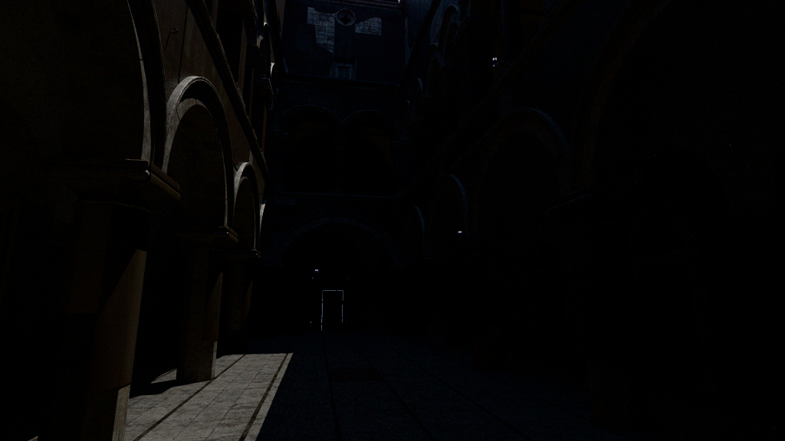
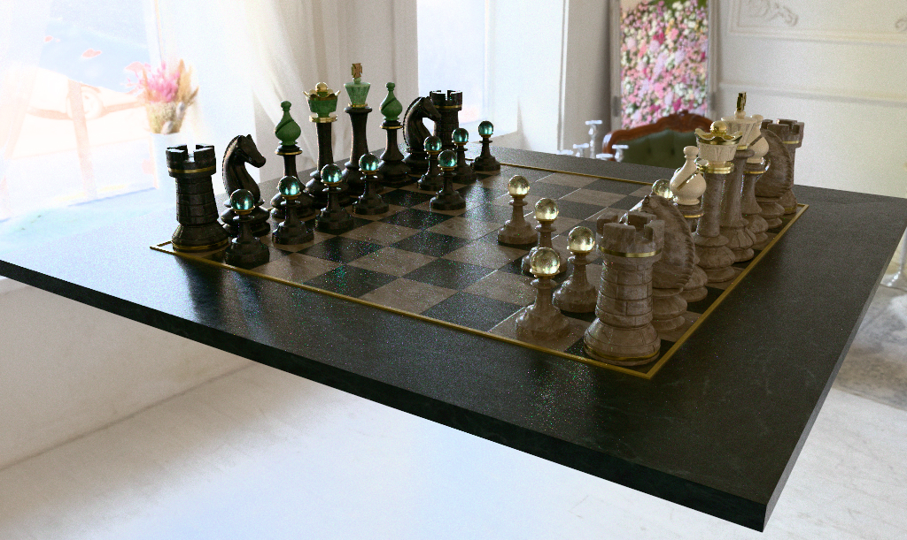
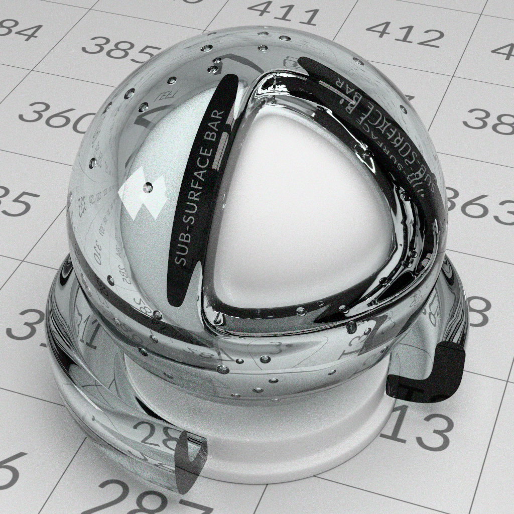
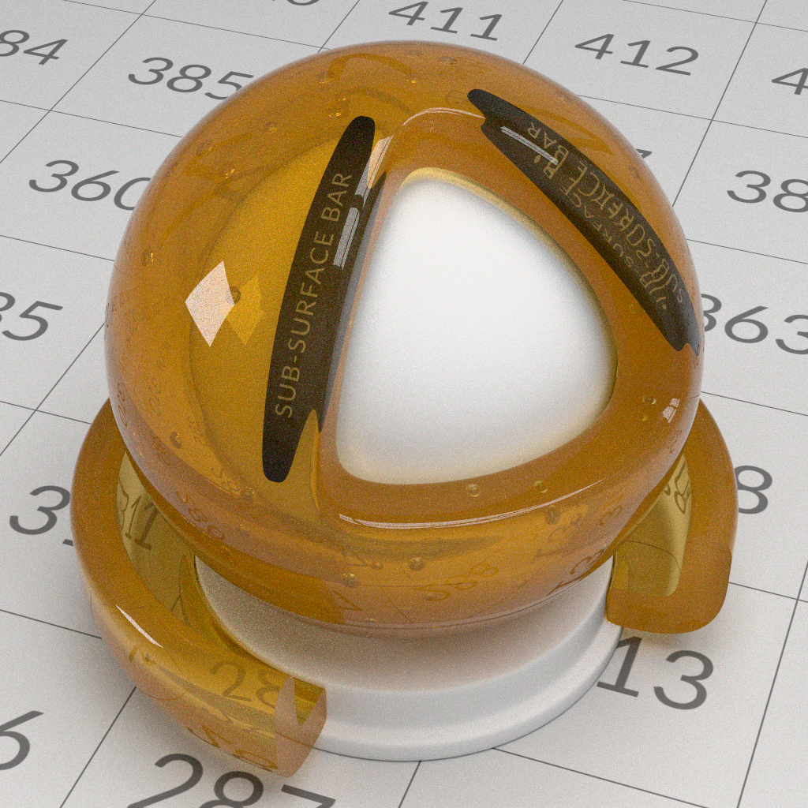
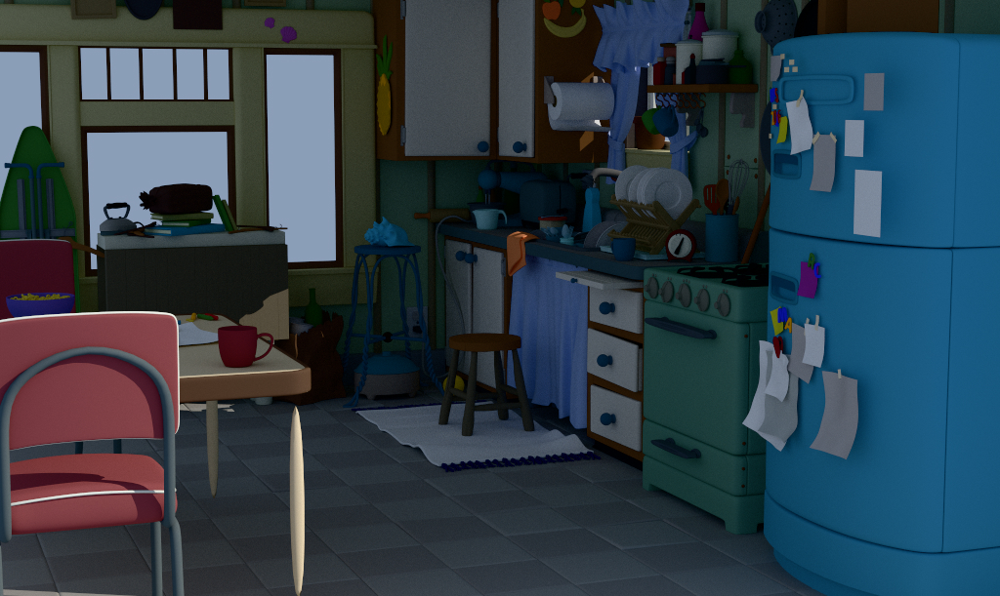
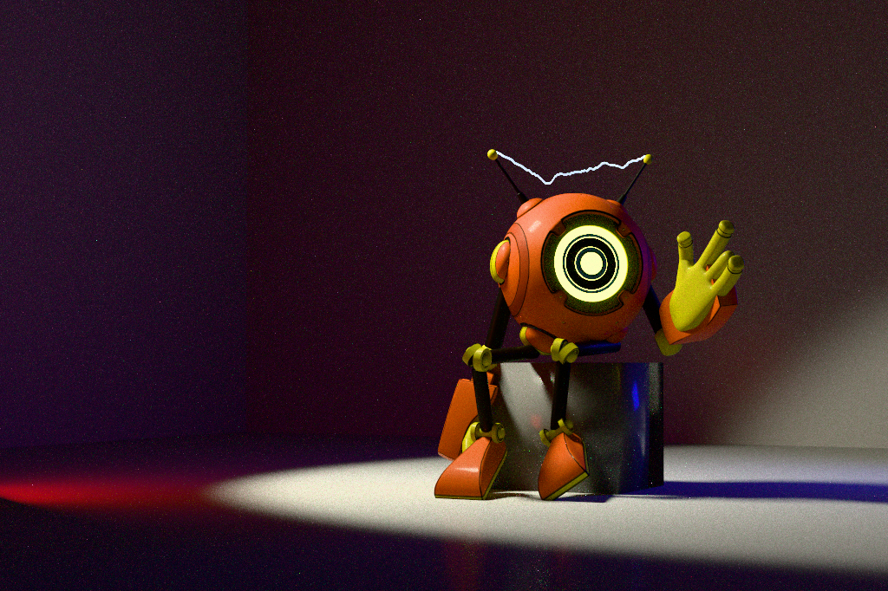
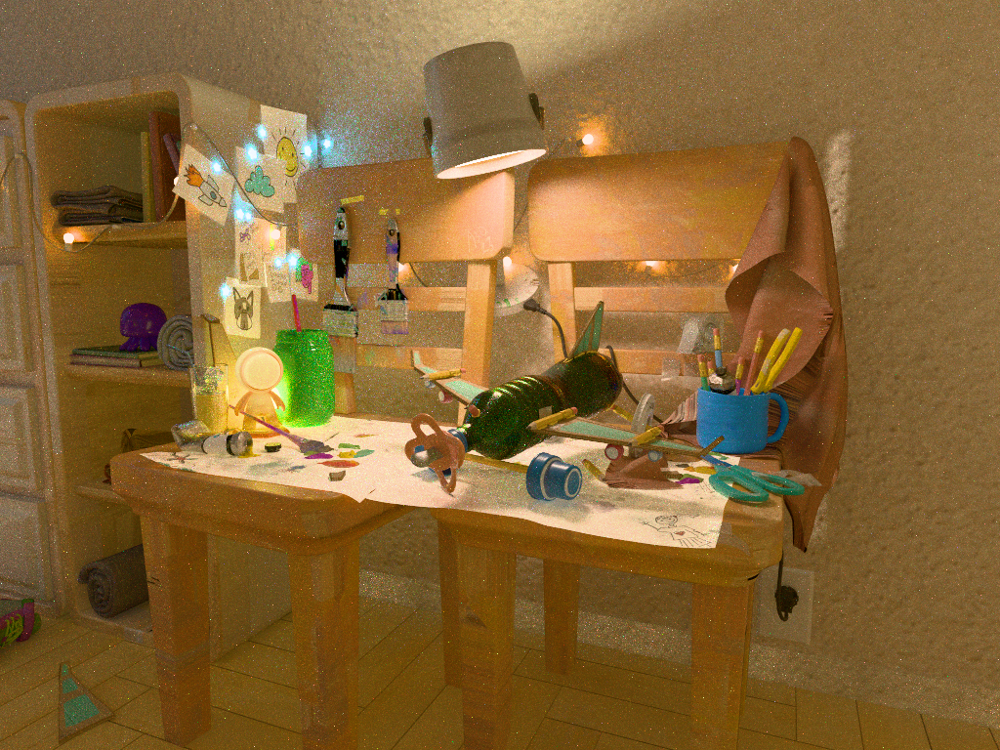
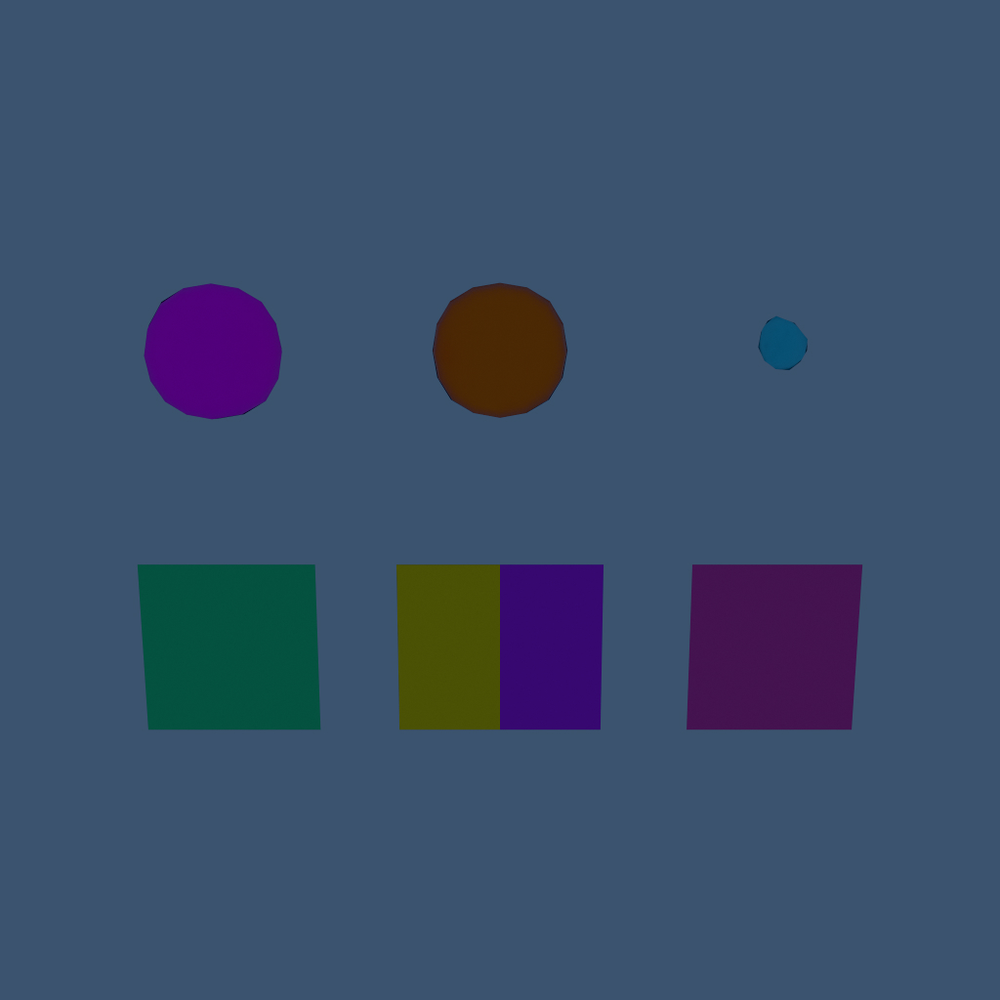
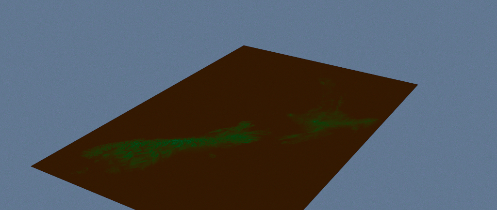

# Gallery

These images are versioned visual baselines, not golden-reference renders. They
exist so that an intentional improvement and an unintentional regression are
both visible in a diff.

**Status: all ten scenes render.** The renderer is under construction; see
[docs/roadmap.md](docs/roadmap.md). These images are what hdClaude produces
today, and every scene below says what its baseline still gets wrong. Judging
those images against the specifications -- USD, MaterialX, the spectral model,
and the physics of path tracing -- is phase 8, and it is not finished.

Each scene shows its baseline inline. The image is the committed artefact
itself, not a reduced copy of it: what a reader sees is the same file the
SHA-256 in the timing table identifies, so a preview cannot drift from the
baseline it stands for.

The first pass through this gallery found seven defects that no test had:
textures uploaded upside down, texture coordinates dropped by refinement and by
the `geompropvalue` path, an image node with no file rendered as a failure, a
prototype reusing another's texture coordinates, an acceleration-structure
scratch address that lost the device, and every refraction evaluated by the
reflection closure. That is what the gallery is for, and it is why the images
are committed before they are right.

## Contract

Baselines are 1024 pixels wide at 1024 samples per pixel, in 32-sample
progressive updates, at the delegate's default path length of eight bounces,
with subdivision at the deterministic level-2 gallery setting. The New Zealand
height map is the deliberate exception: its single authored quad is uniformly
refined at level 6.

**Transport is spectral.** Every image below carries four hero wavelengths per
path; RGB appears only where the asset authors one and where the film resolves
the image. That has a visible cost at a fixed sample count, and it is worth
knowing before reading these images: a pixel's colour comes from four
wavelengths drawn at random, so a grey surface is neutral only in the mean and
every image is speckled with colour where an RGB renderer's would be smooth. It
also costs time -- between fifteen and forty per cent across these ten scenes.
What is not yet spectral: a MaterialX graph's own colour arithmetic, since the
upsampling happens where a closure hands back its response; and dispersion,
which needs the wavelength MIS of phase 6.

There is no displacement — that is phase 16, so the height map's quad is refined
and flat.

The renderer's output is always scene-linear. `render_gallery.bat` records
temporary EXRs under `build/gallery-linear`, then writes the display JPEGs
through a neutral HDR highlight compressor and the standard sRGB transfer
function. `HDCLAUDE_GALLERY_EXPOSURE` sets display exposure in stops; the
versioned baselines use the default of zero.

**Every render is compared against its committed baseline before that baseline
is replaced.** RMS, per-pixel maximum, and failed-pixel count all have
thresholds, and a render that fails any of them stops the script. Exit status
alone is not a gate: hdCodex gated on exit status, and a run that lost the
Vulkan device wrote a black image and exited 0, which was accepted. See
[docs/lessons-from-hdcodex.md](docs/lessons-from-hdcodex.md) R9. Use
`render_gallery.bat -Accept` to deliberately adopt a changed image.

Whenever a baseline is regenerated, refresh its wall time, SHA-256, and machine
record in this file using the exact command shown for that scene. The hashes
identify the committed display JPEGs. Do not infer timings from file timestamps
or from partial diagnostic renders. Timings include renderer startup, scene
loading, MaterialX generation and compilation, geometry processing, and
sampling; display-JPEG conversion is excluded.

`render_gallery.bat` does all of that: it renders each scene, times the render
alone, converts the EXR through `hdClaudeDisplayTransform`, runs
`hdClaudeImageDiff` against the committed baseline, and rewrites the table
below. `-Scene <keys>` renders a subset, `-Accept` adopts a deliberate change,
`-UpdateOnly` rewrites the table without rendering. It stops at the first scene
that fails, so a scene listed as not measured has to be run explicitly once the
scenes before it are fixed.

### Machine record

Recorded with every measurement, because a timing without it cannot be compared
and a device-loss investigation cannot start without it. hdCodex spent days on a
"TDR timeout" hypothesis that this one row falsifies
([lessons](docs/lessons-from-hdcodex.md) R11).

| Field | Value |
|---|---|
| GPU | NVIDIA GeForce RTX 5060 Ti |
| Driver | 32.0.16.1664 |
| `TdrDelay` | 60 |
| `TdrLevel` | unset (default) |
| `TdrDdiDelay` | unset (default) |
| OpenUSD | 26.03 |
| MaterialX | 1.39.3 (from the OpenUSD distribution) |

<!-- gallery-timings:start -->
| Scene | Measured | Wall time | SHA-256 | Device | Settings |
|---|---:|---:|---|---|---|
| Intel Sponza | 2026-09-08 | 51.878 s (0m 51.878s) | `c8ea9d7983453b4531e1ac3fc996db994e06f7757bece73ed940c6bb5cfb4747` | NVIDIA GeForce RTX 5060 Ti | 1024x1024, 1024 spp, 32/update, 8 bounces, subdiv 2 |
| OpenChessSet | 2026-09-08 | 23.215 s (0m 23.215s) | `4e940fb75f63914c061702bb0ee14a2e02fb04580f7c3eed46b0e1d8b0354f0b` | NVIDIA GeForce RTX 5060 Ti | 1024x1024, 1024 spp, 32/update, 8 bounces, subdiv 2 |
| StandardShaderBall Gold | 2026-09-08 | 28.037 s (0m 28.037s) | `3950619920a949c5f02c1773fa6b42188d5385ce36b6c81d605a4aa0037d13f9` | NVIDIA GeForce RTX 5060 Ti | 1024x1024, 1024 spp, 32/update, 8 bounces, subdiv 2 |
| StandardShaderBall Glass | 2026-09-08 | 32.662 s (0m 32.662s) | `00c8eedaba853f1149d65e4a0c9d6b8591ec5ac1d25ab384fd3f50f86c70f4bd` | NVIDIA GeForce RTX 5060 Ti | 1024x1024, 1024 spp, 32/update, 8 bounces, subdiv 2 |
| StandardShaderBall BubbleGum | 2026-09-08 | 30.350 s (0m 30.350s) | `3c38b4a977b8a43f9cfd2371c0a461c2a94a9839c111660e8a869c14f0c43dde` | NVIDIA GeForce RTX 5060 Ti | 1024x1024, 1024 spp, 32/update, 8 bounces, subdiv 2 |
| StandardShaderBall Honey | 2026-09-08 | 103.648 s (1m 43.648s) | `291b6da2583686fc715286386ea72b803e1b4f6862fe00451c49a73482b04d42` | NVIDIA GeForce RTX 5060 Ti | 1024x1024, 1024 spp, 32/update, 8 bounces, subdiv 2 |
| Pixar's KitchenSet | 2026-09-08 | 477.469 s (7m 57.469s) | `00b231edeea1963a6330dc4334268fcf15aa2c1ef9d7d0b7105969923d2d0508` | NVIDIA GeForce RTX 5060 Ti | 1024x1024, 1024 spp, 32/update, 8 bounces, subdiv 2 |
| Collective Project 001 | 2026-09-08 | 17.717 s (0m 17.717s) | `f3ccf0d1ee6243926bfc59d923c1463142cedfa5eb1897984d5a89401a1325bb` | NVIDIA GeForce RTX 5060 Ti | 1024x1024, 1024 spp, 32/update, 8 bounces, subdiv 2 |
| OpenPBR Playground | 2026-09-08 | 68.381 s (1m 8.381s) | `e61f5e4fc8fc2bcfcb06a15d7dc7ad1c110056ee706b23a65c54d864848a04e9` | NVIDIA GeForce RTX 5060 Ti | 1024x1024, 1024 spp, 32/update, 8 bounces, subdiv 2 |
| Subdivision Feature Matrix | 2026-09-08 | 11.203 s (0m 11.203s) | `d7ea0a89e68908790ab111b55072da57e472c23ab062a6d64af154529fc8a99c` | NVIDIA GeForce RTX 5060 Ti | 1024x1024, 1024 spp, 32/update, 8 bounces, subdiv 2 |
| New Zealand Height Map | 2026-09-08 | 8.916 s (0m 8.916s) | `f8cedeacde7deaf6acb8a08e2542d2a8872ad6b3acfd0a6ca01edd5884da4253` | NVIDIA GeForce RTX 5060 Ti | 1024x1024, 1024 spp, 32/update, 8 bounces, subdiv 6 |
<!-- gallery-timings:end -->

## Against hdCodex

**hdCodex is a second opinion, not the answer.** Phase 8 does not ask for parity
with it. Correctness comes from the specifications, and some of that renderer's
images are themselves wrong -- it draws no lights at all, and shades 137 of
Intel Sponza's materials as flat grey -- so a difference is a question rather
than a defect. The question is which renderer the specification agrees with, and
the reading in each row is the answer to that, not a distance still to close.
Several of these divergences are hdClaude being right.

What the comparison is good for is saying where to look. It is what revealed
that the Kitchen Set's committed baseline had been wrong from the day it was
adopted, which no self-comparison could have caught. Mean display brightness of
the two renderers' images of the same stage, at the same camera and settings, is
the crudest possible measure and the one that separates "different" from
"missing":

| Scene | RMS vs hdCodex | mean | reading |
|---|---:|---:|---|
| StandardShaderBall Gold | 0.068 | 0.674 | its mirror now reflects the lights, which hdCodex does not draw at all |
| StandardShaderBall BubbleGum | 0.078 | 0.714 | |
| StandardShaderBall Glass | 0.112 | 0.677 | the largest deliberate divergence in the gallery: the glass holds the highlights of the five rect lights, and hdCodex's image of the same stage has none, because neither renderer used to draw a light. Dispersion still absent |
| Subdivision Feature Matrix | 0.134 | 0.310 | the creased cube is a cube again, now that subdivision tags reach the refiner |
| Pixar's KitchenSet | 0.056 | 0.226 | RMS fell by more than half once instanced meshes stopped losing their transform inside the prototype, and again when the stand-in sun learned which way is up: the stage is Z-up, and the sun's hardcoded Y-up direction had been running horizontally through the room |
| OpenChessSet | 0.045 | 0.556 | 0.199 four changes ago: a normal-map frame, then its dome kept its range and started being sampled where the light is, and now it is lit by that dome alone -- a dome is not in the light table, so the stand-in sun had been adding a second key light to a scene that lights itself |
| OpenPBR Playground | 0.246 | 0.402 | brighter than hdCodex now rather than darker; its float textures no longer clamp |
| Intel Sponza | 0.368 | 0.018 | hdCodex shades 137 `UsdPreviewSurface` materials as flat grey; hdClaude shades the brick and stone the asset authors, in an arcade lit by a stand-in sky and a stand-in sun, which now stands 70 degrees above the horizon and so reaches the floor and the far columns rather than raking the near wall. Roughness and metalness now reach those materials: the asset connects its scalar inputs to a nodegraph's three-component `outputs:rgb`, which `gallery/intel_sponza.usda` overrides to the single channel the maps carry |

Three of these moved *away* from hdCodex on 2026-09-07, when the analytic
lights became emitters a ray can hit. hdCodex does not draw a light either, so
its images have no light in any reflection, and the closer hdClaude gets to what
the scene actually describes the further it reads from that. The glass ball is
the clearest case and the largest divergence in the table.

Parity is not the goal where the two disagree about how much of the asset to
shade. What the comparison is for is finding the places where hdClaude is
missing something, and Sponza is now understood rather than suspect: the
estimator is confirmed by a white furnace -- a 0.8 Lambertian under a unit sky
renders 0.811 against a closed form of 0.800 -- and the same stage rendered
from outside is bright, textured and correct.

## External assets

The gallery stages are thin layers that reference assets living outside this
repository, so the repository stays small and carries no redistributed content.
Each scene below names its source. Paths are absolute in the committed `.usda`
files, matching the development workstation; adjust the `subLayers` path to
relocate an asset.

---

### Intel Sponza



**Source:** [Intel Graphics Research Samples](https://www.intel.com/content/www/us/en/developer/topic-technology/graphics-research/samples.html)

A large textured architectural scene. Its bound materials are USD-native
`UsdPreviewSurface` networks, which hdClaude shades through MaterialX's own
`ND_UsdPreviewSurface_surfaceshader` -- so this baseline is the test of that
path, not of a fallback.

```cmd
set "HDCLAUDE_SAMPLES_PER_PIXEL=1024"
set "HDCLAUDE_SAMPLES_PER_FRAME=32"
render_claude.bat --imageWidth 1024 --colorCorrectionMode disabled --camera PhysCamera001 gallery\intel_sponza.usda build\gallery-linear\intel_sponza.exr
```

**Current state.** Renders its authored materials -- 137 of them, and 25
textures where there were none -- and is still much darker than hdCodex's
baseline of the same stage. The difference is now understood rather than
suspected, and it is two things.

The stage authors no light at all, so both renderers are showing their own
stand-in. hdCodex's is brighter, and hdClaude's is now bright enough to light a
room rather than a tenth of that, which is what the stand-in is for.

The larger part is that hdCodex shades all 137 materials as flat grey
`displayColor` while hdClaude shades the brick, stone and fabric the asset
authors, and an interior of dark albedo under sky-and-sun is genuinely dark.
Matching the brighter image would mean shading less of the asset. What would
close the gap honestly is a stage that authors its own lighting, and an
environment density that samples where the sky actually is -- uniform sphere
sampling spends most of its shadow rays on the ceiling of a covered arcade.

### OpenChessSet



**Source:** [usd-wg/assets OpenChessSet](https://github.com/usd-wg/assets/tree/main/full_assets/OpenChessSet)

Instancing, HDR dome lighting, and many distinct materials. This is the scene
that most directly measures whether per-material dispatch scales.

```cmd
set "HDCLAUDE_SAMPLES_PER_PIXEL=1024"
set "HDCLAUDE_SAMPLES_PER_FRAME=32"
render_claude.bat --imageWidth 1024 --colorCorrectionMode disabled --camera renderCam gallery\chess_board.usda build\gallery-linear\chess_board.exr
```

**Current state.** All thirty-two pieces, in the right places, under the right
half of the HDRI. It took both: the pawns are a `PointInstancer` whose
instances hdClaude was not placing, and the dome was sampled half a turn out of
USD's orientation, so the scene was lit and backed by the wall behind the
camera.

The pieces were faceted and the board carried a fine herringbone until two
defects in how a normal map is read were fixed together: the tangent frame was
taken from a triangle edge rather than solved from the texture coordinates, so
every map was applied at a rotation that changed per triangle, and the maps
themselves -- 8-bit JPEGs on `vector3` and `float` nodes -- were being
sRGB-decoded, which tilts a flat normal map and exaggerates every bump. Every
material in this asset is a `<normalmap>`, so the set showed both at once.

Its dome then stopped being clamped. The 4k HDRI behind this scene is a float
image, and every texture was being quantised into eight bits, so the window and
the lamps that are the whole of its light were flattened to white. Restoring
the range made the image brighter, correct in the mean, and covered in
fireflies -- which is what uniform sphere sampling of a real HDRI produces --
until the environment gained a distribution built from its own luminance. What
the scene shows now is a room lit through a window, with the window's light
where it belongs. RMS against hdCodex has gone 0.199, 0.108, 0.060 across the
three changes.

### StandardShaderBall Gold


**Source:** [usd-wg/assets StandardShaderBall](https://github.com/usd-wg/assets/tree/main/full_assets/StandardShaderBall)

Artistic-metalness conductor response.

```cmd
render_claude.bat --imageWidth 1024 --colorCorrectionMode disabled --camera camera gallery\shader_ball_gold.usda build\gallery-linear\shader_ball_gold.exr
```

**Current state.** The conductor reads as metal, the inner shell is neutral,
and the ground now carries the region of its texture that it should -- the same
numbers in the same places as hdCodex. This scene found two texture defects:
every texture was uploaded upside down, and the ground and all five walls
author their UVs face-varying, which hdClaude used to reject and shade from
barycentrics instead.

### StandardShaderBall Glass



**Source:** [usd-wg/assets StandardShaderBall](https://github.com/usd-wg/assets/tree/main/full_assets/StandardShaderBall)

Spectral dielectric transmission, dispersion, and total internal reflection.
The scene where four hero wavelengths earn their cost.

```cmd
render_claude.bat --imageWidth 1024 --colorCorrectionMode disabled --camera camera gallery\shader_ball_glass.usda build\gallery-linear\shader_ball_glass.exr
```

**Current state.** Transmits. It rendered opaque black until the integrator
stopped evaluating refractions with the reflection closure, which is the defect
this scene exists to catch. Dispersion is still absent -- transport is RGB
until phase 6 -- so the glass is colourless where it should split.

### StandardShaderBall BubbleGum


**Source:** [usd-wg/assets StandardShaderBall](https://github.com/usd-wg/assets/tree/main/full_assets/StandardShaderBall)

Subsurface transport and image textures.

```cmd
render_claude.bat --imageWidth 1024 --colorCorrectionMode disabled --camera camera gallery\shader_ball_bubblegum.usda build\gallery-linear\shader_ball_bubblegum.exr
```

**Current state.** Renders. Subsurface is a published closure parameter and not
yet transported, so the material reads as a diffuse surface.

### StandardShaderBall Honey



**Source:** [usd-wg/assets StandardShaderBall](https://github.com/usd-wg/assets/tree/main/full_assets/StandardShaderBall),
with an `open_pbr_surface` authored in `gallery/openpbr_honey.mtlx`

An interior medium, which is a different thing from a tinted surface. OpenPBR
hands a transmissive material's colour to its *volume* whenever
`transmission_depth` is above zero -- the surface tint is deliberately dropped --
so this scene renders identically to clear glass in any renderer that publishes
the medium and never transports it, which is what hdClaude did until 2026-09-07.

```cmd
render_claude.bat --imageWidth 1024 --colorCorrectionMode disabled --camera camera gallery\shader_ball_honey.usda build\gallery-linear\shader_ball_honey.exr
```

**Current state.** Renders, with Beer-Lambert absorption over the distance each
path travels inside the shell and a random walk for the scattering the asset
authors at 0.9, which is what makes it cloudy rather than a clear amber.
Absorption is spectral and exact; scattering is achromatic, so the colour comes
from absorption alone -- a chromatic scattering coefficient sampled against one
control wavelength overflows over a long walk, and the fix for that is spectral
MIS across the lanes. There is also no next-event estimation at a scattering
vertex, so the medium is lit by what enters it and the estimate is noisier than
an opaque surface's.

### Pixar's KitchenSet



**Source:** [OpenUSD Kitchen Set](https://openusd.org/release/dl_kitchen_set.html)

Authored Z-up coordinates, deep instancing, and unbound meshes that fall back to
`displayColor`. Also the subdivision performance reference.

```cmd
render_claude.bat --imageWidth 1024 --colorCorrectionMode disabled --camera renderCam gallery\pixar_kitchen.usda build\gallery-linear\pixar_kitchen.exr
```

**Current state.** Renders, and is the most expensive scene in the gallery at
about two minutes. It used to lose the Vulkan device inside scene publication;
the cause was an acceleration-structure scratch address that did not meet
`minAccelerationStructureScratchOffsetAlignment`, which is a build requirement
no allocator enforces. Its unbound meshes fall back to `displayColor` as the
asset intends.

Until recently its refrigerator, stove, table and chairs were simply not in the
image, and the props that were had drifted into the air. Nothing was missing:
all 1788 mesh instances the stage holds were published, each at its instancer's
placement and *without* its own transform inside the prototype, which 1460 of
the 1462 meshes have. Every model's parts therefore collapsed onto that model's
origin. It is the defect that says most about this gallery's limits -- the gate
compares a render against its own committed baseline, so it could never flag a
baseline that was wrong when adopted, and it took hdCodex's image of the same
stage to see it. RMS against hdCodex fell from 0.194 to 0.074.

### Collective Project 001



**Source:** [usd-wg/collectiveproject001](https://github.com/usd-wg/collectiveproject001/blob/main/shots/s001_001/index.usda)

UsdSkel deformation through Hydra `extComputation`, and per-face material
subsets. The scene that exercises in-place BLAS update under deformation.

```cmd
render_claude.bat --imageWidth 1024 --colorCorrectionMode disabled --purposes render --camera mono gallery\collectiveproject001.usda build\gallery-linear\collectiveproject001.exr
```

**Current state.** Renders: the skinned character deforms through its
`ExtComputation`, the per-face material subsets read correctly, and the
electric arc between the antennae is a curve primitive reading a float geomprop
this renderer does not carry, so it takes that geomprop's zero and shades
white. It needed `UsdPrimvarReader` rewritten into the `geompropvalue` it
wraps, which MaterialX cannot read through a nodegraph interface.

### OpenPBR Playground



**Source:** [OpenPBRShaderPlayground](https://github.com/DigitalProductionExampleLibrary/OpenPBRShaderPlayground/blob/main/ShdrPlygrnd/ShdrPlygrnd_OpenPBR.usda)

The MaterialX/OpenPBR reference. This is the scene hdClaude's whole shading
commitment is aimed at: every material here must compile and execute through
the `genglsl_pt` target with no approximation and no fallback
([docs/materialx-codegen.md](docs/materialx-codegen.md) 8).

It is also the scene on which hdCodex reproducibly lost the Vulkan device.
Recorded here so the first hdClaude run of it is treated as evidence.

```cmd
render_claude.bat --imageWidth 1024 --colorCorrectionMode disabled --purposes render --camera renderCam_mainCU gallery\openpbr_playground.usda build\gallery-linear\openpbr_playground.exr
```

**Current state.** Renders, after three unrelated refusals were resolved:
`mx_aastep`'s `dFdx`, an `open_pbr_surface` input this MaterialX does not
declare, and eighty-five UDIM textures whose `<UDIM>` token opened nothing. All
100 of its textures load: the ones that did not were a UDIM set authored on
tile 1003 rather than 1001, and three 16-bit masks this renderer used to
refuse -- not, as it looked, a missing TIFF decoder.

It was also a blizzard of fireflies on every surface, and that turned out not
to be a sampling problem: 132 of its material nodes are `<normalmap>`, and both
of the defects the chess set exposed -- an edge-derived tangent frame and
sRGB-decoded data maps -- perturb a normal into directions the surface never
faces, which is a firefly generator. With those fixed the image is still the
noisiest in the gallery, which is what an interior lit through small emitters
looks like while the analytic lights have no MIS of their own, but it is noise
rather than a hash. Its 195 meshes that author face-varying `primvars:normals`
are also read now, though most of them are `catmullClark` and so take the limit
surface's normals rather than the cage's.

Its float textures then stopped being quantised into eight bits, which
brightened it: it now reads brighter than hdCodex where it used to read darker,
and RMS against that baseline moved the wrong way, 0.235 to 0.262. That is a
real change in the right direction being measured against a baseline this
renderer is not yet trying to match. What it costs is time -- 55 seconds to
103 -- because a hundred textures at sixteen bits a channel is twice the
sampler bandwidth. The scene has no dome light, so the environment distribution
does nothing for it, and the firefly cluster on the toy aeroplane's fuselage is
still there: one material, not the whole image, and not yet diagnosed.

It is also the scene on which hdCodex reproducibly lost the Vulkan device.
hdClaude renders it in 55 seconds.

### Subdivision Feature Matrix



A renderer-owned scene isolating six subdivision paths: an indexed face-varying
UV seam, a Catmull-Clark cube with edge creases and a sharp corner, a Loop
tetrahedron, a Catmull-Clark grid with a holed coarse face, two coarse-face
material subsets, and MaterialX displacement on a bilinear patch.

```cmd
set "HDCLAUDE_ENABLE_SUBDIVISION=1"
set "HDCLAUDE_SUBDIVISION_LEVEL=2"
set "HDCLAUDE_ENABLE_DISPLACEMENT=1"
render_claude.bat --imageWidth 1024 --colorCorrectionMode disabled --camera camera gallery\subdivision_features.usda build\gallery-linear\subdivision_features.exr
```

**Current state.** Renders, and is the cheapest scene in the gallery. The
displacement panel is flat, because displacement is phase 16.

The creased cube was a smooth brown blob until 2026-09-07, when subdivision
tags started reaching the refiner. Its creases, corners and boundary rule had
been dropped on the way in, so the one shape in the gallery whose whole purpose
is to prove creases survive refinement was proving the opposite -- against a
baseline that had recorded the rounded version as correct.

The UV-seam sphere was a flat magenta until 2026-09-07: its material named
`newzealand_height_map.png`, which lives under `gallery/textures/`, so the file
was never found and hdClaude drew the failure placeholder it draws for a texture
it cannot read. The baseline had encoded that placeholder since the scene was
adopted, so the seam test asserted nothing about a seam -- the gate only ever
compared one flat colour against the same flat colour. `check_usd_materials.py`
found the broken path on its first run, which is the argument for the tool in
one line.

### New Zealand Height Map



One authored bilinear quad displaced by a MaterialX `ND_image_float` height map
after uniform level-6 refinement. The same map drives surface colour, so texture
resolution and UV orientation are visible independently of the displaced
silhouette. The texture is committed under `gallery/textures/`.

```cmd
set "HDCLAUDE_ENABLE_SUBDIVISION=1"
set "HDCLAUDE_SUBDIVISION_LEVEL=6"
set "HDCLAUDE_ENABLE_DISPLACEMENT=1"
render_claude.bat --imageWidth 1024 --colorCorrectionMode disabled --camera camera gallery\newzealand_heightmap.usda build\gallery-linear\newzealand_heightmap.exr
```

**Current state.** The map reaches the surface: both islands are legible in
the quad's colour, which is what says the image node, the UV orientation and
the texture resolution are all right. The quad is refined to level 6 and is
still perfectly flat, because displacement is phase 16 -- so what this scene
now isolates is displacement alone, where it used to be failing at the texture
before it ever got there.
